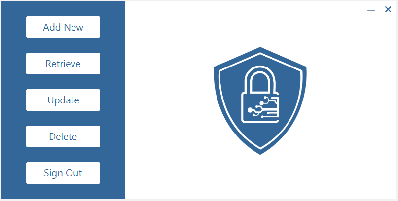

<h1>Login Manager</h1>
<h2>About</h2>

A JavaFx application that uses the MVC architecture to store login information for websites to a file in encrypted format. After signing up, information entered will be written to the accounts file. A file will be created for each new account created to store login information. Jasypt library used to handle the encryption and decryption purposes when writing to or reading from all files.

<h2>Main Login Scene</h2>

The user has the option to Sign In to a previously created account or choose the Sign Up option to start a new one. Forgot Password* button allows the user to enter their username in which the program will check the accounts file, if a match is found then the program will send the forgotten password to the email address the user entered when signing up. 

* To use the Forgotten Password feature, you need to create an email account for the program to use (only Gmail currently supported) and assign it to SENDER under sendEmail() in the Accounts class. Password for the email account will need to be assigned to PASSWORD.

If any textfields are left blank, a red style will be applied to show that the missing information is required. If any information entered is incorrect, such as wrong username or password when trying to Sign In, a red toast message will appear from the bottom displaying the error.

<h2>Menu Option Scene</h2>

After a successful Sign In or Sign Up, the program will give the user options on what they want to do. 
Such options include....  
<b>Add New</b> - add new login information to their file 
<b>Retrieve</b> - retrieve forgotten information for a previously entered website 
<b>Update</b> - update the username and/or password for a previously entered website 
<b>Delete</b> - delete login information for a website that is no longer needed 
<b>Sign Out</b> - sign out of current account and return to the main login scene

As with the main login scene, any textfields left blank will be changed to red, to show that it is required. Any incorrect information entered such as a website that is not found on file, a red toast message will appear to show that there was no match found. If the selected action was completed successfully, a green toast message will appear letting the user know the process was completed.

